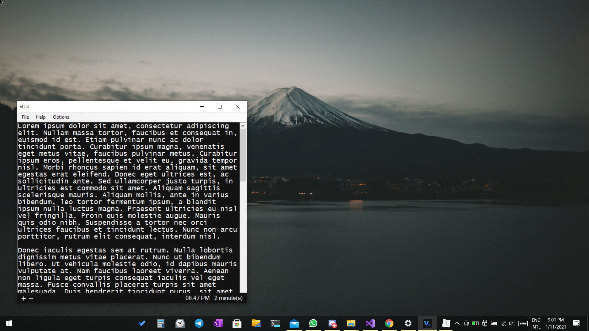
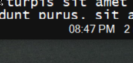
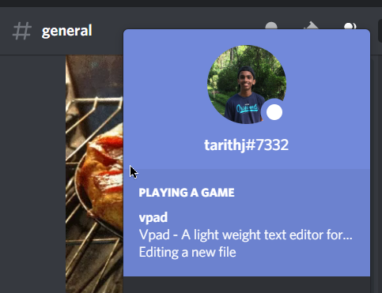

# Vpad

Vpad is a opensource alternative to notepad made for the 21st century.

## Features
* Char count
   
* Word count
   
* Reading time
   
* Current time(24 hour/12 hour)

* Discord integration

